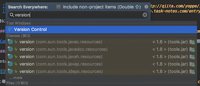
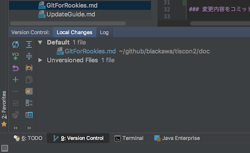
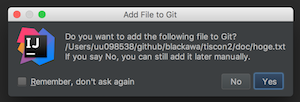
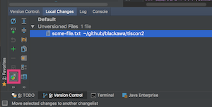
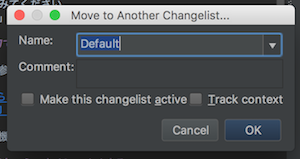
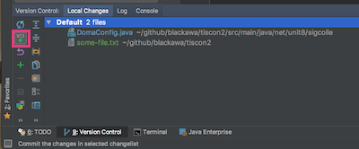
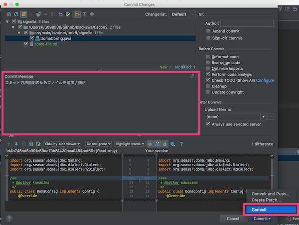
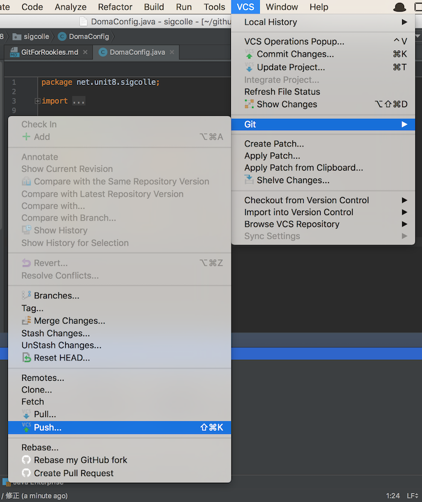
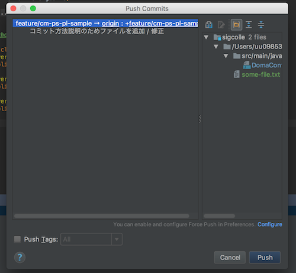
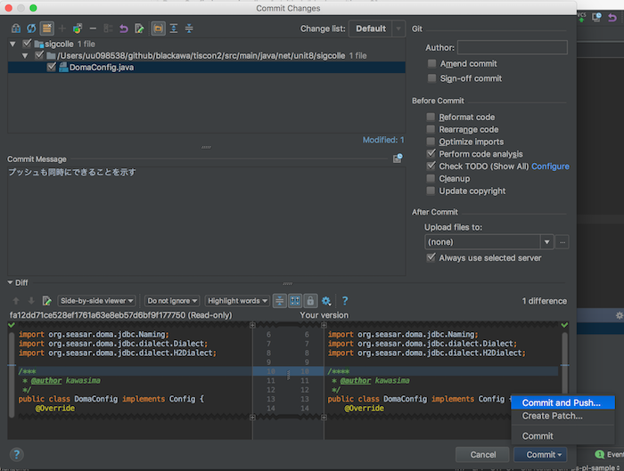

# Gitルーキートラの巻 :tiger:

## Gitとは

ファイルのバージョン管理ツールです。詳しくは以下サイトが非常にわかりやすいです。

* [サルでもわかるGit入門](http://www.backlog.jp/git-guide/)
* [Gitチュートリアル | Atlassian](https://www.atlassian.com/ja/git)

特に[サルでもわかるGit入門](http://www.backlog.jp/git-guide/)は非常に秀逸です。
[Gitの基本](http://www.backlog.jp/git-guide/intro/intro1_1.html)では、Git自体の概要と基本的なキーワードを学べます。
[リポジトリの共有](http://www.backlog.jp/git-guide/intro/intro3_1.html)では、ソースコードの変更をアップロード / ダウンロードする方法が学べます。

ぜひ一読してみてください。
「リポジトリ」「アド」「コミット」「プッシュ」「プル」といわれてなんとなくイメージが湧けばOKです！

## IntelliJでのGitの使い方

以下の記事が参考になります。

* [意外と知らないIntelliJ IDEAのGit管理機能いろいろ（´-`） - Qiita](http://qiita.com/yoppe/items/fd03607d4d4f191d32dd)
* [IntelliJ IDEAでGitとGitHubを使用する方法 - TASK NOTES](http://www.task-notes.com/entry/20160511/1462935600)

特によく使う機能については、以下にまとめておきます。

### Git操作用のタブを開く

IntelliJで `Shift` キーを2回連続で押します。すると検索窓が表示されるので、 `version` と入力します。

すると `Version Control` が検索にヒットするのでそれを選択します。すると `Version Control` タブが開きます。今後Gitの操作では頻繁にこのタブを使います。

### 変更内容をコミット([Commit](https://www.atlassian.com/ja/git/tutorial/git-basics#!commit))する

[Commit](https://www.atlassian.com/ja/git/tutorial/git-basics#!commit) は、現在の作業状態を将来見直せる形でセーブしたい時に使います。つまりコーヒーを買いに行く時には使いませんが、帰宅する前やタスクが終わった時には使います。

#### 新規に追加したファイルは Changelist に追加する

IntelliJでファイルを新規作成すると、作成時に

と尋ねられるので、「Yes」と答えておいてください。これでファイルが [add](https://www.atlassian.com/ja/git/tutorial/git-basics#!add) されます。

もしIntelliJ以外からファイルを追加した時(画像ファイルをディレクトリ移動させてきた時など)は、 `Version Control` タブで [add](https://www.atlassian.com/ja/git/tutorial/git-basics#!add) したいファイルをクリックしてから `Move to Another Changelist` ボタンをクリックして、

ファイルを `Default` に追加しましょう。

ちなみに Changelist は IntelliJ 特有の仕組みです。

#### [Commit](https://www.atlassian.com/ja/git/tutorial/git-basics#!commit) する

[Commit](https://www.atlassian.com/ja/git/tutorial/git-basics#!commit) したくなったら、 `Version Control` タブの `Default` 内のリストを見てみてください。変更したいものがすべてこの内部に入っていれば準備OKです。

そして `Version Control` タブの `Commit Changes` ボタンをクリックして、

コミット画面を開きます。

コミットの内容が分かるようなメッセージを **必ず** 書いて、 `Commit` ボタンをクリックすればコミット完了です。

### リモートリポジトリの内容をダウンロード([Pull](https://www.atlassian.com/ja/git/tutorial/remote-repositories#!pull))する

[Pull](https://www.atlassian.com/ja/git/tutorial/remote-repositories#!pull) は、他のチームメンバーが書いてくれたコードを自分のPCにダウンロードする時に使います。

IntelliJで `VCS` > `Git` > `Pull` をクリック。

[Pull](https://www.atlassian.com/ja/git/tutorial/remote-repositories#!pull) のオプションを選ぶ画面が表示されるので、

自分が更新をダウンロードしたいリモートリポジトリを選択して `Pull` をクリック。([更新手引き](UpdateGuide.md)のリンクから来た方は、ここで `tiscon` を選択する必要があるはずです)

もし「File Merged with Conflicts」という以下のようなメッセージが表示されたら、本家リポジトリの変更内容とローカルの変更内容が競合しています。

`Merge` ボタンをクリックして変更内容を確認し、残しておきたい方の変更を取り込んでください。

### ローカルリポジトリの内容をアップロード([Push](https://www.atlassian.com/ja/git/tutorial/remote-repositories#!push))する

[Push](https://www.atlassian.com/ja/git/tutorial/remote-repositories#!push) は、自分のPCの[Commit](https://www.atlassian.com/ja/git/tutorial/git-basics#!commit)内容を他のチームメンバーに共有したい時に使います。コミットされていない内容はアップロードできないので、まだ[Commit](https://www.atlassian.com/ja/git/tutorial/git-basics#!commit)していない人はまず[Commit](https://www.atlassian.com/ja/git/tutorial/git-basics#!commit)しましょう。

`VCS` > `Git` > `Push` をクリックして[Push](https://www.atlassian.com/ja/git/tutorial/remote-repositories#!push)画面を開きます。

自分がした[Commit](https://www.atlassian.com/ja/git/tutorial/git-basics#!commit)が表示されるので、思ったとおりの内容なら `Push` をクリック。

これで [Push](https://www.atlassian.com/ja/git/tutorial/remote-repositories#!push) は完了です。

ちなみに、[Commit](https://www.atlassian.com/ja/git/tutorial/git-basics#!commit)内容を即[Push](https://www.atlassian.com/ja/git/tutorial/remote-repositories#!push)してしまいたければ、[Commit](https://www.atlassian.com/ja/git/tutorial/git-basics#!commit)時に `Commit and Push` を選択すればできます。

