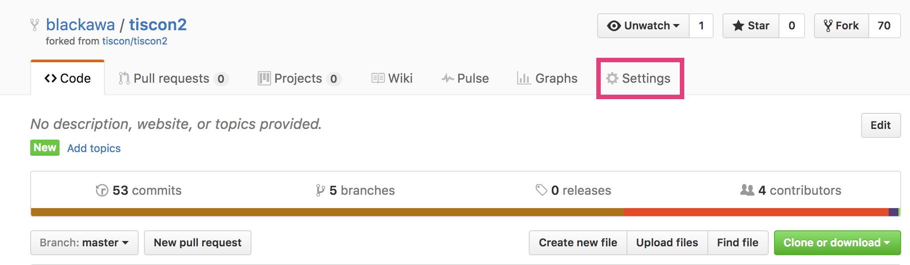
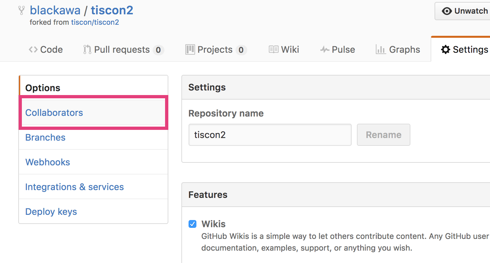
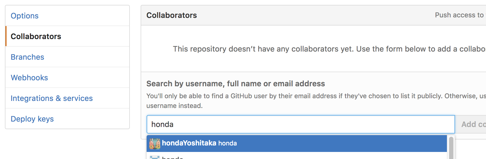

# 更新手引き

## 本家リポジトリの更新を自分のリポジトリに取り込みたい

fork元の本家リポジトリ( https://github.com/tiscon/tiscon2 ) に更新があった時、それを自分のリポジトリに取り込む手順です。

### 前提条件

[Gitルーキートラの巻](GitForRookies.md)を一読してある、もしくは内容が分かること。

### 本家リポジトリを参照できるようにする( `git remote add` )

https://github.com/tiscon/tiscon2.git を tiscon という名前でリモートリポジトリに追加します。

IntelliJで `VCS` > `Git` > `Remotes` をクリック。

nameに `tiscon` 、 URLに `https://github.com/tiscon/tiscon2.git` と入力してOKをクリック。

### 本家リポジトリの変更を取り込む

tisconのmasterブランチをローカルのmasterブランチにダウンロードします。

[リモートリポジトリの内容をダウンロード(Pull)する | Gitルーキートラの巻 :tiger:](GitForRookies.md#リモートリポジトリの内容をダウンロードpullする)と同様の手順でダウンロードしてください。

### 自分のリポジトリに変更をアップロードする

[ローカルリポジトリの内容をアップロードpushする | Gitルーキートラの巻 :tiger:](GitForRookies.md#ローカルリポジトリの内容をアップロードpushする)と同様の手順で、originリポジトリに変更をPushしてください。

## チームメンバーのリポジトリの更新を自分のリポジトリに取り込みたい
1. [本家リポジトリを参照できるようにする( `git remote add` )](#本家リポジトリを参照できるようにする-git-remote-add-) と同じ手順で、更新を取り込みたいチームメンバーのリポジトリを参照できるようにします。その時、登録するURLは `https://github.com/更新を取り込みたいチームメンバーのGitHubアカウント名/tiscon2.git` で、その時の登録名はそのメンバーのGitHubアカウント名にしましょう。
1. [リモートリポジトリの内容をダウンロード(Pull)する | Gitルーキートラの巻 :tiger:](GitForRookies.md#リモートリポジトリの内容をダウンロードpullする)と同様の手順でダウンロードしてください。その時、ダウンロード元のリモートリポジトリは、更新を取り込みたいチームメンバーのものを選択してください。
1. [ローカルリポジトリの内容をアップロードpushする | Gitルーキートラの巻 :tiger:](GitForRookies.md#ローカルリポジトリの内容をアップロードpushする)と同様の手順で、originリポジトリに変更をPushしてください。

## チームで作業を分担したい
チームで仕事をしていると、作業分担をしたくなります。その時は以下の手順で作業を分担し、それを集めることができるようになります。

### チームで代表のリポジトリを1つ決める
決めてください。

### 代表のリポジトリにチームメンバーを招待する
代表のリポジトリのユーザーは自分のリポジトリにアクセスして、 `Settings` タブをクリックしてください。

表示された画面で `Collaborators` タブをクリックします。

パスワードを再入力するよう言われるので入力すると、リポジトリの参加者を追加できます。チームメンバーのGitHubアカウント名を入力して追加しましょう。

チームメンバーには、登録したメールアドレス宛にリポジトリへの招待メールが来ます。 `Approve` (承認)すると、今後代表のリポジトリに作業内容をアップロードできるようになります。

### 代表のリポジトリをcloneし直す
自分のPCでtiscon2を動かす([Windowsマシン](https://github.com/tiscon/tiscon2-startup-guide/blob/master/doc/operationCheckWin.md) / [Macマシン](https://github.com/tiscon/tiscon2-startup-guide/blob/master/doc/operationCheckMac.md))の手順に従って、代表のリポジトリを再度cloneしましょう。

> **補足**
> * 自分のリポジトリからcloneしたソースコードと名前が被るはずなので、違う名前に変えておきましょう。

これで、代表のリポジトリをチームメンバー全員で共有できました。今後あなたがアップロードした内容は他のチームメンバーにも共有されます。

### 作業内容をアップロードする
作業内容をアップロードしたくなったら以下の手順でできます。

1. [変更内容をコミット(Commit)する | Gitルーキートラの巻 :tiger:](GitForRookies.md#変更内容をコミットcommitする)を参考に、作業内容を保存します。
1. [リモートリポジトリの内容をダウンロード(Pull)する | Gitルーキートラの巻 :tiger:](GitForRookies.md#リモートリポジトリの内容をダウンロードpullする)を参考に、他のチームメンバーが自分より先にアップロードした内容をダウンロードします。ここで自分の作業内容と競合した時は、すでにアップロードされている内容を尊重しながら競合を解決してください。ただしここは難しいので、スタッフを呼んでもかまいません。
1. [ローカルリポジトリの内容をアップロード(Push)する | Gitルーキートラの巻 :tiger:](GitForRookies.md#ローカルリポジトリの内容をアップロードpushする)を参考に、作業内容をアップロードします。
